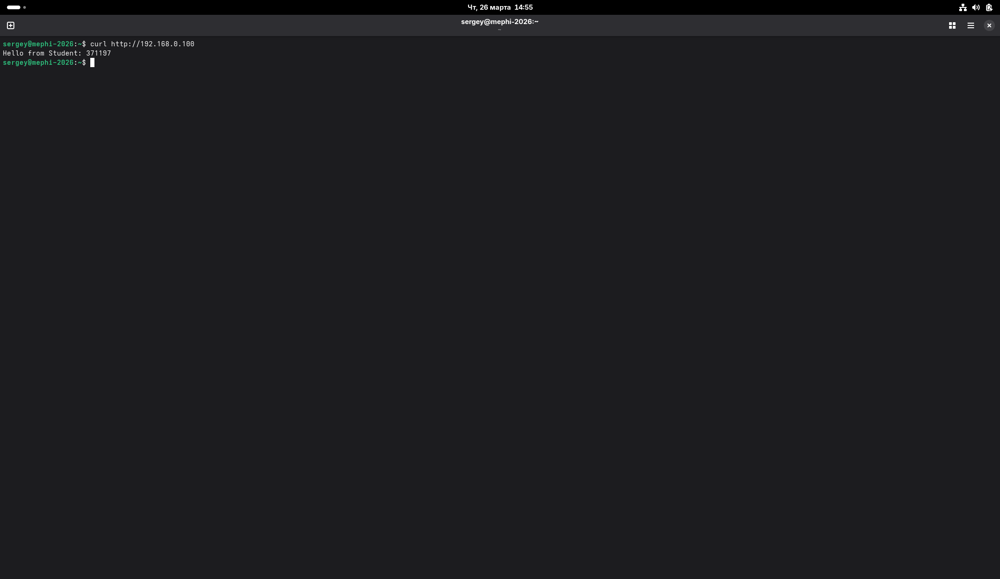

# MEPHI Session Project 2026

##  Описание

Сессионный проект по дисциплине **«Операционные системы семейства Unix»**.
В рамках проекта была настроена виртуальная машина Fedora с сетевой конфигурацией, веб-сервером и системой контроля доступа.

---

##  Выполненные задачи

###  Сеть

* Настроен сетевой интерфейс через `nmcli`
* Проверена маршрутизация (`ip route`)
* Проверено подключение (`ping 8.8.8.8`)

---

###  Установка пакетов

Установлены:

* `nginx`
* `tcpdump`
* `firewalld`
* `sudo`
* инструменты для SELinux

---

###  Диск

* Добавлен дополнительный диск (`/dev/sdb`)
* Создана файловая система
* Смонтирован в `/data/mephi-web`

---

###  Веб-сервер (nginx)

* Настроен nginx
* Проверка:

```bash
curl http://localhost
```

Вывод:

```
Hello from Student: 371197
```

---

###  SELinux

* Установлены правильные контексты:

```
httpd_sys_content_t
```

---

###  Capabilities

* Для `tcpdump` установлены:

```
cap_net_admin,cap_net_raw
```

---

###  SSH

* Настроен и запущен `sshd`

---

##  Содержимое репозитория

* `.txt` отчёты
* `index.html`
* `.rpm` пакет
* `mephi-nginx-screenshot.png`

---

##  Скриншот



---

##  Результат

Сервер успешно отвечает:

```bash
curl http://192.168.0.100
```

```
Hello from Student: 371197
```

---

> Примечание: в ходе выполнения проекта статический адрес был адаптирован под фактическую подсеть хоста `192.168.0.0/24`, поэтому использовался адрес `192.168.0.100/24` вместо `192.168.1.100/24`. Это необходимо для корректной сетевой связности.

##  Автор

Студент: **371197**

